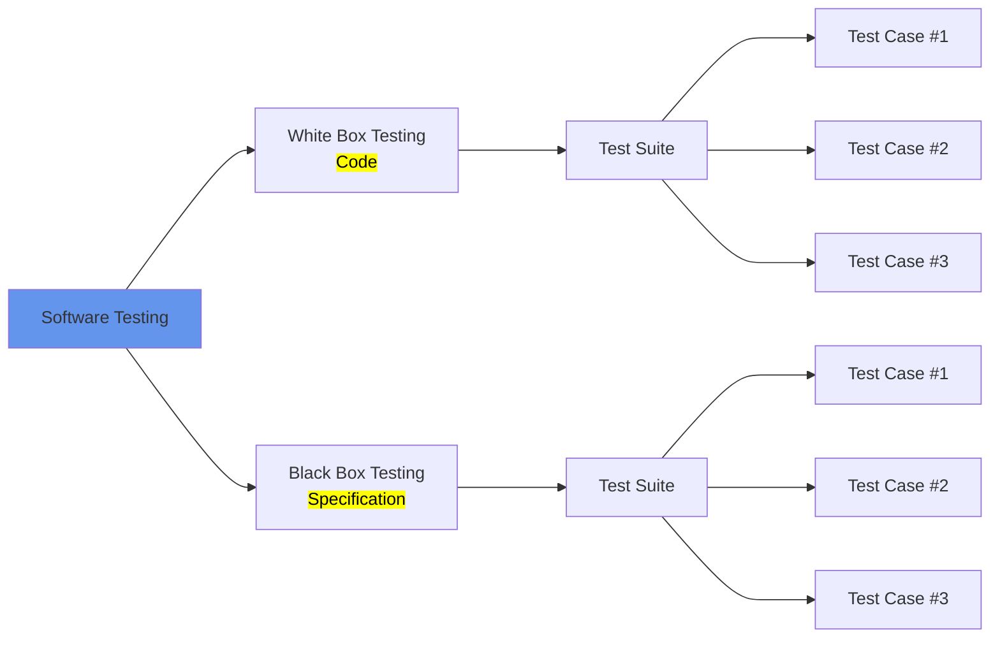

```mermaid
flowchart TB
	subgraph <strong>How software is developed<strong>
		direction LR
		req[Requirements \n Gathering] --> spec[Specifications] --> impl[Implementation] --> verif[Verification]
		subgraph <mark><strong>Software Testing</strong></mark>
		verif --> val[Validation]
		end
	end
	
```


