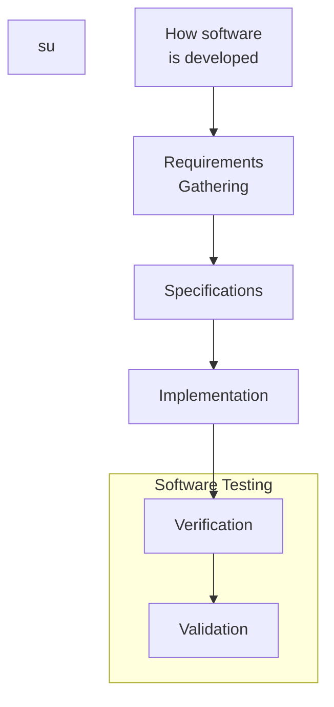

```mermaid
flowchart TB
su
	software[How software \n is developed]-->req[Requirements \n Gathering]
	req --> spec[Specifications] --> impl[Implementation]
	impl --> verif[Verification]
	subgraph Software Testing
		direction LR
		verif --> val[Validation]
	end
	
```
