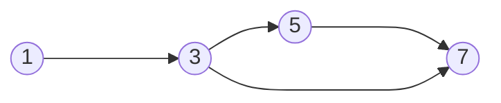

### $C_0$ Coverage (aka Statement Coverage)

If every ==reachable node== of program graph exists in the execution path of some test input, then we can say that test suite provides $C_0$ coverage.

### $C_1$ Coverage (aka Branch Coverage)

If every ==reachable edge== of program graph exists in the execution path os some test input, then that test suite provides $C_1$ coverage.

---
### Example explaining $C_0$ and $C_1$ Coverages 

```Java
public static void abs (int x)
{
	if (x < 0)
	{
		x = -x;
	}
	return x;
}
```

**Program graph for above program:**



**Test suite with $C_0$ Coverage for above program:**
<table style="text-align:center; width:100%;">  
  <tr style="background-color: #dddddd;">  
    <th style="text-align:center">Test Case</th>  
    <th style="text-align:center">x</th>    
    <th style="text-align:center">Expected Output</th>
  </tr>  
  <tr>  
    <td>1</td>  
    <td>-1</td>  
    <td>1</td> 
  </tr>   
</table>

**Test suite with $C_1$ Coverage for above program:**
<table style="text-align:center; width:100%;">  
  <tr style="background-color: #dddddd;">  
    <th style="text-align:center">Test Case</th>  
    <th style="text-align:center">x</th>  
    <th style="text-align:center">Expected Output</th>
  </tr>  
  <tr>  
    <td>1</td>  
    <td>-1</td>  
    <td>1</td> 
  </tr>   
  <tr>  
    <td>2</td>  
    <td>1</td>  
    <td>1</td> 
  </tr>   
</table>

The intuition behind the number of test cases is, we write just enough number of test cases that can provide the coverage we need. 

For $C_0$, one test case was enough cos the input -1 was able to reach every node in the program graph.

For $C_1$ though we needed two cos it's about reaching every reachable edge. The input -1 takes the path $\langle 1,2,3,4 \rangle$ and doesn't cover the path $\langle 1,2,4 \rangle$, but the input 1 does, so we write two test cases for $C_1$ coverage.

---

### $C_i(k)$ Coverage

Used for testing correct loop execution.

**Formal definition**: A test suite provides $C_i(k)$ coverage if for every loop in P (Program) and for all $j ∈ \{0,...,k\}$, there exists a test case case in the test suite whose ==execution path visits the loop guard exactly $j + 1$ times, provided that there exists a feasible path that does so==. For nested loops, the loop guard must be visited j + 1 times before a loop guard for an enclosing loop is visited.

**Explanation**: If there is a while loop in the program and we want to achieve $C_i(3)$ coverage, then we need to execute that loop, 0, 1, 2 and 3 times if possible.

**For example**, take below program which increments a variable `i` for `n` times and prints the increment number after each increment.

```Java
public void print_increment(int n)
{
	int i = 0;
	if (n == 0)
	{
		System.out.println(i);
	}
	else {
		while (i < n)
		{
			i = i + 1;
			System.out.println(i);
		}
	}
}
```

For the above program, if we want $C_i(3)$ coverage, we need the while loop to execute 0, 1, 2 and 3 times.
- Nothing happens when the loop is executed 0 times.
- When it's executed once, 1 need to be printed.
- When it's executed two times, 1 and 2 need to be printed.
- When it's executed three times, 1, 2 and 3 need to be printed.

So we can test the program with inputs - 0, 1, 2, 3.

This is a test suite that can provide $C_i(3)$ coverage for the above program.
<table style="text-align:center; width:100%;">  
  <tr style="background-color: #dddddd;">  
    <th style="text-align:center">Test Case</th>  
    <th style="text-align:center">n</th>  
    <th style="text-align:center">Expected Output</th>
  </tr>  
  <tr>  
    <td>1</td>  
    <td>0</td>  
    <td>0</td> 
  </tr>   
  <tr>  
    <td>2</td>  
    <td>1</td>  
    <td>1</td> 
  </tr> 
  <tr>  
    <td>3</td>  
    <td>2</td>  
    <td>1, 2</td> 
  </tr>   
  <tr>  
    <td>4</td>  
    <td>3</td>  
    <td>1, 2, 3</td> 
  </tr>    
</table>

---

