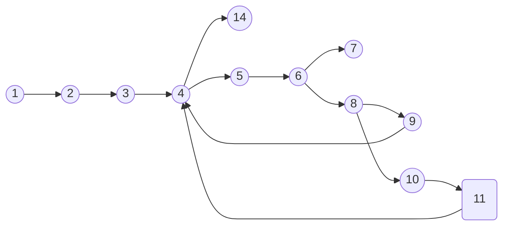

**Group Members**

Sudheer Paturi - 2232843
Dominik Wieczynski - 2237383
Pragun Joshi - 

---

### Problem 01

##### Task 01

##### Task 02

The program seems to have one infeasdoesn't have any unreachable nodes or infeasible edges. There is atleast one input for which, each edge and node of the program is reachable. 

For example, if we give the inputs $[1,2,3,5,6,7,8,9,10]$ and $7$, the nodes $1,2,3,4,5,6,7,8,9,10,11$ are reachable. If we give the inputs $[2,3,5,6]$ and $1$, the nodes $1,2,3,4,5,6,8,9,14$ are reachable. These two examples gives the insight that all the edges of the program are reachable as well.

[more explicit this input this execution path] 

##### Task 03
Minimal test suite that provides $C_1$ coverage but doesn't provide $C_i(2)$ coverage.
<table style="text-align:center; width:100%;">  
  <tr style="background-color: #dddddd;">  
    <th style="text-align:center">Test Case</th>  
    <th style="text-align:center">Array []xs</th>  
    <th style="text-align:center">Find x</th>  
    <th style="text-align:center">Expected Output</th>
    <th style="text-align:center">Observed Output</th>
  </tr>  
  <tr style="text-align:center; width:100%;">  
    <td>1</td>  
    <td>{1,2,3,5,6}</td>  
    <td>5</td> 
    <td>3</td>
    <td>3</td>  
  </tr>   
  <tr style="text-align:center; width:100%;">  
    <td>2</td>  
    <td>{2,3,5,6}</td>  
    <td>1</td> 
    <td>-1</td>
    <td>-1</td> 
  </tr>   
</table>

##### Task 04
Minimal test suite that provides $C_i(2)$ coverage. The while loop executes 0, 1, 2 times. However the nodes 8 and 9 of the program are never executed for any of the following test cases, thus it doesn't achieve $C_0$ coverage.
<table style="text-align:center; width:100%;">  
  <tr style="background-color: #dddddd;">  
    <th style="text-align:center">Test Case</th>  
    <th style="text-align:center">Array []xs</th>  
    <th style="text-align:center">Find x</th>  
    <th style="text-align:center">Expected Output</th>
    <th style="text-align:center">Observed Output</th>
  </tr>  
  <tr style="text-align:center; width:100%;">  
    <td>1</td>  
    <td>{1}</td>  
    <td>1</td> 
    <td>0</td>
    <td>-1</td>  
  </tr>
  <tr style="text-align:center; width:100%;">  
    <td>2</td>  
    <td>{1,2,3}</td>  
    <td>2</td> 
    <td>1</td>
    <td>1</td>  
  </tr>
  <tr style="text-align:center; width:100%;">  
    <td>3</td>  
    <td>{1,2,3,5,6,7}</td>  
    <td>5</td> 
    <td>3</td>
    <td>3</td>  
  </tr>    
</table>

##### Task 05

##### Task 06

The loop executes infintely for test inputs of x that don't exist in the array inputs of xs. For example, take {1,2,3,5,6,7} as xs array input and for x take 4 as input. The expected behaviour og the program is that the loop should execute 2 times and return -1 as the output. But the program goes into a continous loop. This is something that should have been caught in the $C_i(2)$ test suite coverage but wasn't. 

##### Task 07

##### Task 08

In the first test case, the input for $x$ doesn't exist in the array input, and therefore the expected output is -1 but the observed output is 'Infinite loop'.

In the second test case, the lenght of the array is even digits. For the inputs given, the expected output is 2 but the observed output is 'Infinite loop'.

In the third test case, the length of the array is odd digits. For the inputs given, the expected output is 2 but the observed output is 'Infinite loop'.
<table style="text-align:center; width:100%;">  
  <tr style="background-color: #dddddd;">  
    <th style="text-align:center">Test Case</th>  
    <th style="text-align:center">Array []xs</th>  
    <th style="text-align:center">Find x</th>  
    <th style="text-align:center">Expected Output</th>
    <th style="text-align:center">Observed Output</th>
  </tr>  
  <tr style="text-align:center; width:100%;">  
    <td>1</td>  
    <td>{1,3,5}</td>  
    <td>4</td> 
    <td>-1</td>
    <td>Infinite loop</td>  
  </tr>
  <tr style="text-align:center; width:100%;">  
    <td>2</td>  
    <td>{1,2,3,4}</td>  
    <td>3</td> 
    <td>2</td>
    <td>Infinite loop</td>  
  </tr>
  <tr style="text-align:center; width:100%;">  
    <td>3</td>  
    <td>{1,2,5}</td>  
    <td>5</td> 
    <td>2</td>
    <td>Infinite loop</td>  
  </tr>    
</table>
