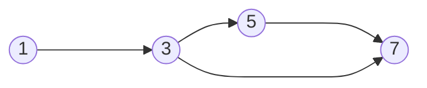

### $C_0$ Coverage (aka Statement Coverage)

If every ==reachable node== of program graph exists in the execution path of some test input, then we can say that test suite provides $C_0$ coverage.

### $C_1$ Coverage (aka Branch Coverage)

If every ==reachable edge== of program graph exists in the execution path os some test input, then that test suite provides $C_1$ coverage.

---
### Example explaining $C_0$ and $C_1$ Coverages 

```Java
public static void abs (int x)
{
	if (x < 0)
	{
		x = -x;
	}
	return x;
}
```

**Program graph for above program:**



**Test suite with $C_0$ Coverage for above program:**
<table style="text-align:center; width:100%;">  
  <tr style="background-color: #dddddd;">  
    <th style="text-align:center">Test Case</th>  
    <th style="text-align:center">x</th>    
    <th style="text-align:center">Expected Output</th>
  </tr>  
  <tr>  
    <td>1</td>  
    <td>-1</td>  
    <td>1</td> 
  </tr>   
</table>

**Test suite with $C_1$ Coverage for above program:**
<table style="text-align:center; width:100%;">  
  <tr style="background-color: #dddddd;">  
    <th style="text-align:center">Test Case</th>  
    <th style="text-align:center">x</th>  
    <th style="text-align:center">Expected Output</th>
  </tr>  
  <tr>  
    <td>1</td>  
    <td>-1</td>  
    <td>1</td> 
  </tr>   
  <tr>  
    <td>2</td>  
    <td>1</td>  
    <td>1</td> 
  </tr>   
</table>

The intuition behind the number of test cases is, we write just enough number of test cases that can provide the coverage we need. For C_0, one test case was enough cos the input -1 was able to reach every node in the program graph.
For C_1 though we needed two cos, the input -1 takes the path $\langle 1,2,3,4 \rangle$ and doesn't cover the path $\langle 1,2,4 \rangle$, but the input 1 does, so we write two test cases for $$

---

