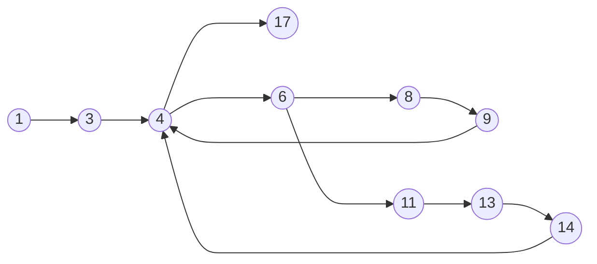
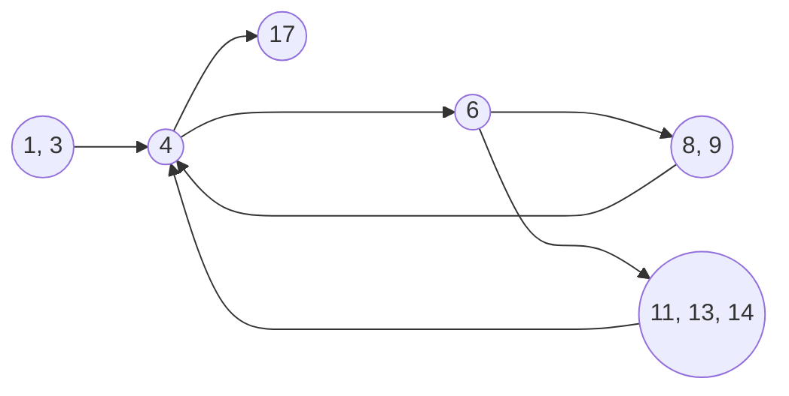

### Exercise 01

###### Task 01

```mermaid
flowchart LR
	id1((1)) --> id2((3)) --> id3((4)) ---> id10((17)) & id4((6))
	
	id4 ---> id5((8)) & id7((11))
	
	id5 --> id6((9))
	
	id6 --> id3
	
	id7 --> id8((13)) --> id9((14))
	
	id9 --> id3
```

##### Task 02

```mermaid
flowchart LR
	id1((1, 3)) --> id2((4)) ----> id3((6)) ---> id4((8, 9)) & id5((11, 13, 14))
	id2 --> id6((17))
	id5 --> id2
	id4 --> id2
```

Task 03

If a path in the graph is not reachible by any input given to the program, that path can be considered as infeasible.

Task 04

