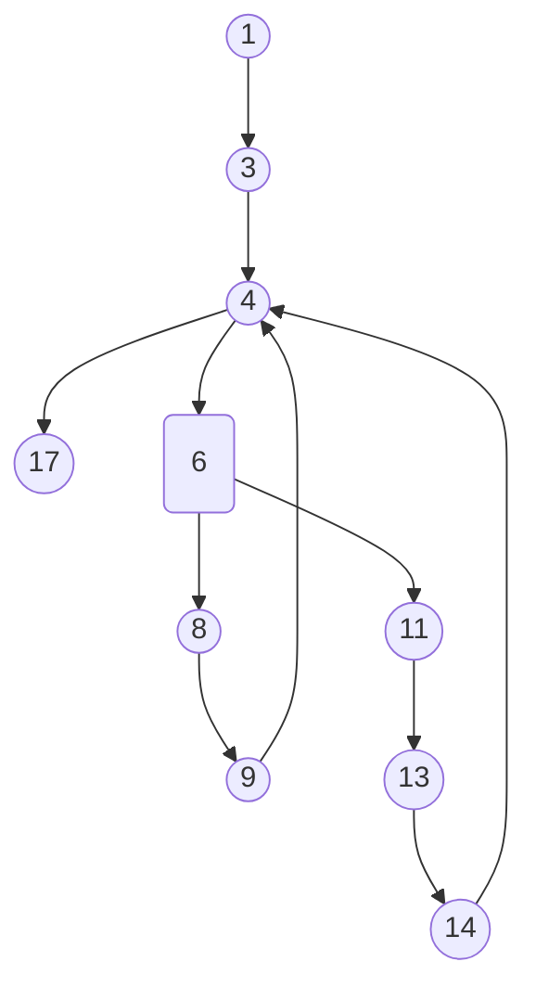

Exercise 01

Task 01

```mermaid
flowchart TD
	id1((1)) --> id2((3)) --> id3((4)) --> id10((17)) & id4((6))
	id4(6) --> id5((8)) & id7((11))
	id5((8)) --> id6((9))
	id6((9)) --> id3((4))
	id7((11)) --> id8((13)) --> id9((14))
	id9((14)) --> id3((4))
```
