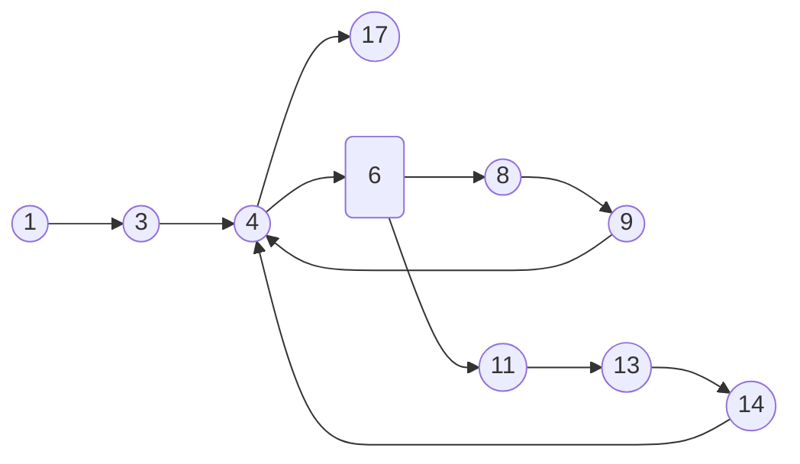
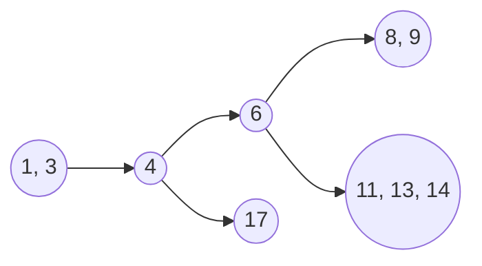

### Exercise 01

###### Task 01

```mermaid
flowchart LR
	id1((1)) --> id2((3)) --> id3((4)) --> id10((17)) & id4((6))
	
	id4(6) --> id5((8)) & id7((11))
	
	id5((8)) --> id6((9))
	
	id6((9)) --> id3((4))
	
	id7((11)) --> id8((13)) --> id9((14))
	
	id9((14)) --> id3((4))
```

##### Task 02

```mermaid
flowchart LR
	id1((1, 3)) --> id2((4)) --> id3((6)) --> id4((8, 9)) & id5((11, 13, 14))
	id2((4)) --> id6((17))
	
```
