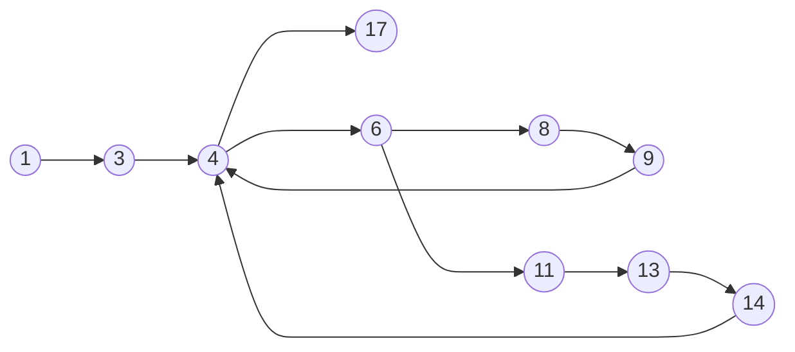
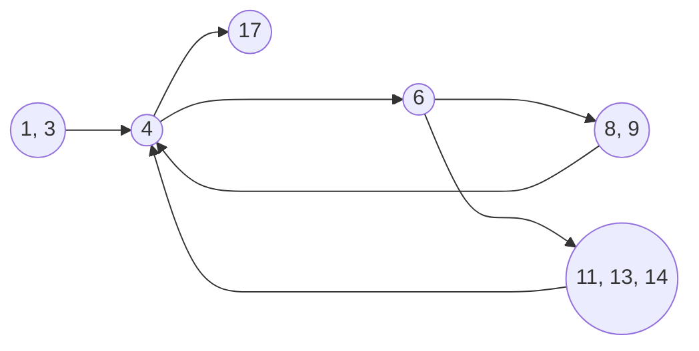
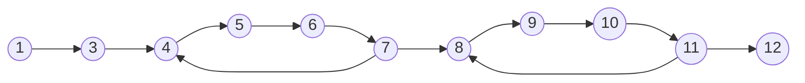
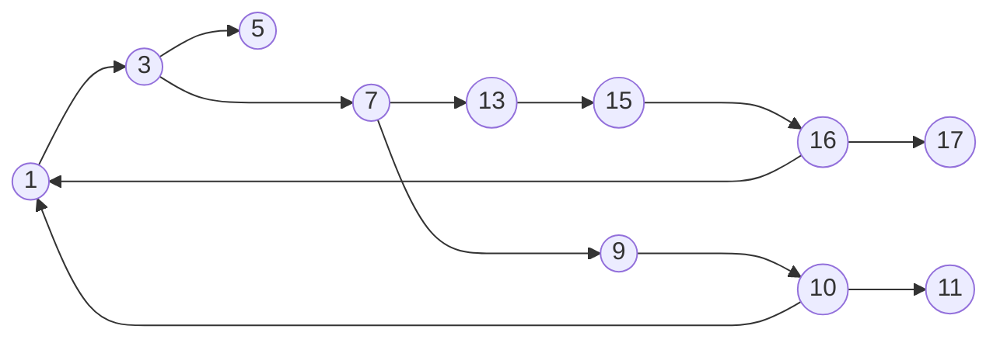

### Exercise 01

###### Task 01



##### Task 02



##### Task 03

Execution paths of the program:
$\langle 1,3,4,17 \rangle$
$\langle 1,3,4,6,8,9,17 \rangle$
$\langle 1,3,4,6,11,13,14,4,17 \rangle$

##### Task 04

```Java
public static int addNew(int x, int y) 
{	
	int sum = y;   
	do {
	    sum = sum - 1;
	    x = x + 1;
	} while(x <= 0);       
	do {
	    sum = sum + 1;
	    x = x - 1;
	} while(x > 0);
	return sum;     
}
```

**Program graph for the refactored program:**


##### Task 05

Test Case | x | y | Expected Output
:--: | :-: | : - : | :--:
1 | -1 | -1 | -2
2 | 0 | 0 | 0
3 | 1 | 1 | 2


### Exercise 02

##### Task 01


