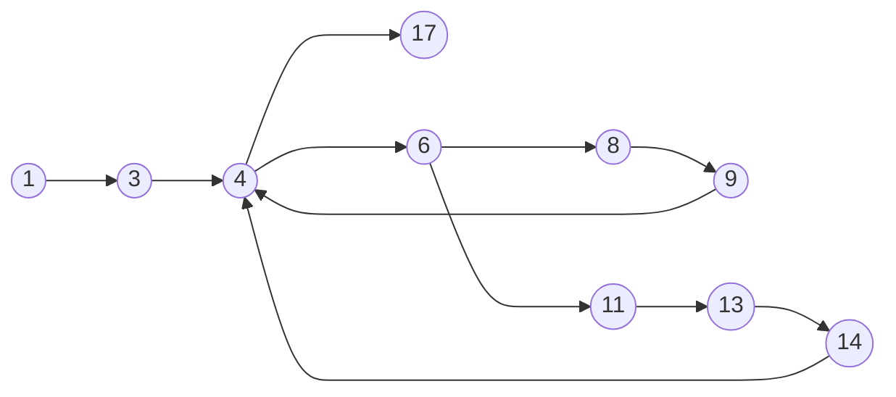
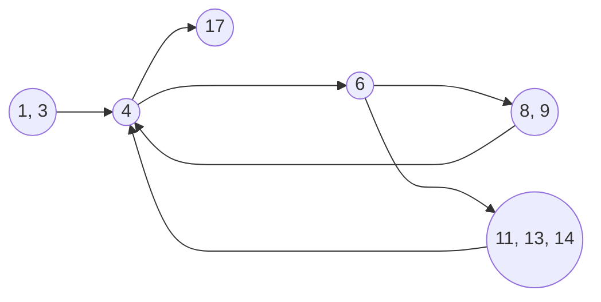
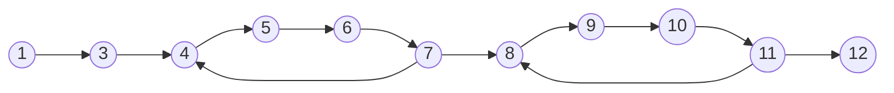
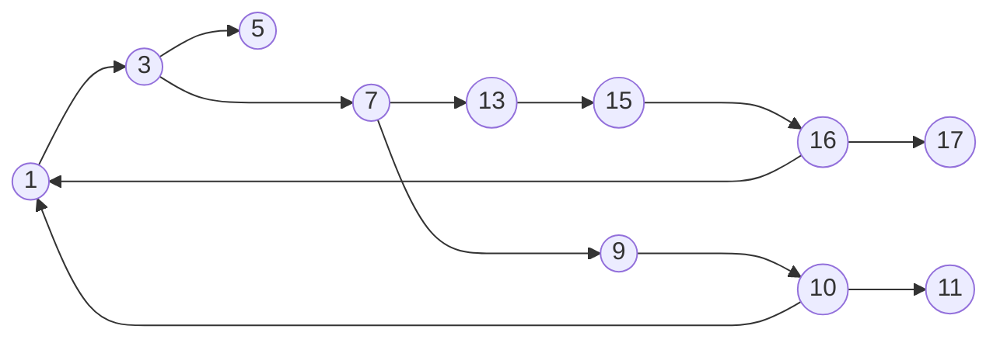

### Exercise 01

###### Task 01


---
##### Task 02


---
##### Task 03

**Possible execution paths of the program:**
$\langle 1,3,4,17 \rangle$
$\langle 1,3,4,6,11,13,14,4,17 \rangle$

**Infeasible paths of the program:**
$\langle 6,8,9 \rangle$
$\langle 6,8,9,4,11 \rangle$
$\langle 6,8,9,4,11,13,14,4,17 \rangle$
$\langle 6,8,9,4,17 \rangle$

---
##### Task 04

```Java
public static int addNew(int x, int y) 
{	
	int sum = y;   
	do {
	    sum = sum - 1;
	    x = x + 1;
	} while(x <= 0);       
	do {
	    sum = sum + 1;
	    x = x - 1;
	} while(x > 0);
	return sum;     
}
```

**Program graph for the refactored program:**

---
##### Task 05

Test Case | x | y | Expected Output
:--: | :-: | : - : | :--:
1 | -1 | -1 | -2
2 | 0 | 0 | 0
3 | 1 | 1 | 2

<table style="text-align:center; width:100%;">  
  <tr style="background-color: #dddddd;">  
    <th style="text-align:center">Test Case</th>  
    <th style="text-align:center">x</th>  
    <th style="text-align:center">y</th>  
    <th style="text-align:center">Expected Output</th>
  </tr>  
  <tr>  
    <td>1</td>  
    <td>-1</td>  
    <td>-1</td> 
    <td>-2</td> 
  </tr>  
  <tr>  
    <td>2</td>  
    <td>0</td>  
    <td>0</td> 
    <td>0</td> 
  </tr> 
  <tr>  
    <td>3</td>  
    <td>1</td>  
    <td>1</td> 
    <td>2</td> 
  </tr>   
</table>

---

### Exercise 02

##### Task 01


---
##### Task 02

I don't think there are any infeasible paths in the program.
The program does have an issue executing for inputs less than 0 for exponent but that condition is never handled in the program, so that's the program fault, it's a specification issue.

Not sure about the unreachable nodes or edges. I think all nodes & edges are reachable for relevant inputs.

---
##### Task 03
Test Case | base | exponent | modulus | Expected Output
:--: | :-: | : - : | :--: | :--:
1 | -2 | 0 | 2 | 1
2 | 0 | 3 | 2 | 0
3 | 2 | 2 | 5 | 4

---
##### Task 04

A high quality test suite covers as many behaviours of the program as possible. I don't think we can consider the c1 test suite as high quality for this program as it only ensures whether a certain input reaches the edges of the program graph. There are some inputs which the program might not be able to handle which are not covered in the c1 test suite.

---
##### Task 05

The pre-conditions given for the program are **base x is an integer, the exponent n is a non-negative integer, and the modulus m is an integer > 1**

For those conditions, yes it does produce the right output.

<table>  
  <tr>  
    <th>Company</th>  
    <th>Contact</th>  
    <th>Country</th>  
  </tr>  
  <tr>  
    <td>Alfreds Futterkiste</td>  
    <td>Maria Anders</td>  
    <td>Germany</td>  
  </tr>  
  <tr>  
    <td>Centro comercial Moctezuma</td>  
    <td>Francisco Chang</td>  
    <td>Mexico</td>  
  </tr>  
</table>