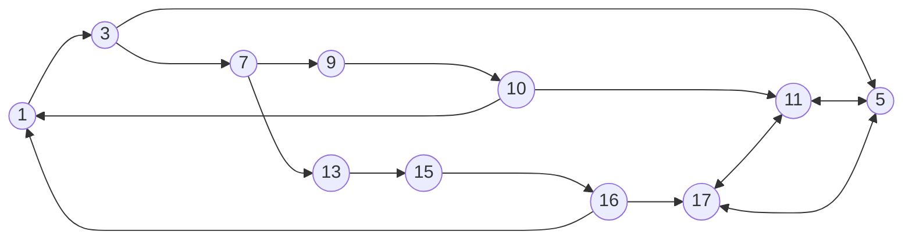

### Exercise 01

###### Task 01


---
##### Task 02


---
##### Task 03

**Possible execution paths of the program:**
$\langle 1,3,4,17 \rangle$
$\langle 1,3,4,6,11,13,14,4,17 \rangle$

**Infeasible paths of the program:**
$\langle 6,8,9 \rangle$
$\langle 6,8,9,4,11 \rangle$
$\langle 6,8,9,4,11,13,14,4,17 \rangle$
$\langle 6,8,9,4,17 \rangle$

---
##### Task 04

```Java
public static int addNew(int x, int y) 
{	
	int sum = y;   
	do {
	    sum = sum - 1;
	    x = x + 1;
	} while(x <= 0);       
	do {
	    sum = sum + 1;
	    x = x - 1;
	} while(x > 0);
	return sum;     
}
```

**Program graph for the refactored program:**

---
##### Task 05
<table style="text-align:center; width:100%;">  
  <tr style="background-color: #dddddd;">  
    <th style="text-align:center">Test Case</th>  
    <th style="text-align:center">x</th>  
    <th style="text-align:center">y</th>  
    <th style="text-align:center">Expected Output</th>
  </tr>  
  <tr>  
    <td>1</td>  
    <td>-1</td>  
    <td>-1</td> 
    <td>-2</td> 
  </tr>  
  <tr>  
    <td>2</td>  
    <td>0</td>  
    <td>0</td> 
    <td>0</td> 
  </tr> 
  <tr>  
    <td>3</td>  
    <td>1</td>  
    <td>1</td> 
    <td>2</td> 
  </tr>   
</table>

---

### Exercise 02

##### Task 01


---
##### Task 02

I don't think there are any infeasible paths in the program.
The program does have an issue executing for inputs less than 0 for exponent but that condition is never handled in the program, so that's the program fault, it's a specification issue.

Not sure about the unreachable nodes or edges. I think all nodes & edges are reachable for relevant inputs.

---
##### Task 03
<table style="text-align:center; width:100%;">  
  <tr style="background-color: #dddddd;">  
    <th style="text-align:center">Test Case</th>  
    <th style="text-align:center">base</th>  
    <th style="text-align:center">exponent</th>  
    <th style="text-align:center">modulus</th>
    <th style="text-align:center">Expected Output</th>
  </tr>  
  <tr>  
    <td>1</td>  
    <td>-2</td>  
    <td>0</td> 
    <td>2</td>
    <td>1</td>
  </tr>  
  <tr>  
    <td>2</td>  
    <td>0</td>  
    <td>3</td> 
    <td>5</td>
    <td>0</td> 
  </tr> 
  <tr>  
    <td>3</td>  
    <td>2</td>  
    <td>2</td> 
    <td>5</td>
    <td>4</td> 
  </tr>   
</table>

---
##### Task 04

A high quality test suite covers as many behaviours of the program as possible. 
c1 could be considered as a high quality test case which could give us a basic test benchmark.
But there are some inputs which the program might not be able to handle which are not covered in the c1 test suite.

---
##### Task 05

The pre-conditions given for the program are **base x is an integer, the exponent n is a non-negative integer, and the modulus m is an integer > 1**

For those conditions, yes it does produce the right output but there is no upper limit given so we are not sure how it will peform for high integers.