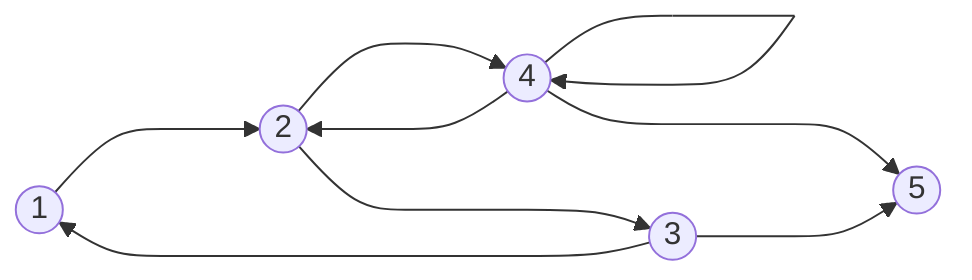

## What

A path is a finite or inifinte sequennce of vertices of a graph.

An **==execution path==** of an input to the program, is the sequence of statements that are executed for that particular input.

## Why

We use paths to check the feasibility of a program, whethere it's feasible for all inputs or only certain inputs. 

This will help us find faults in the program that maybe not be usually found just by executing the code.

## How

Take for example the following graph:

Here, some of the paths in the program are:
1. $\langle 1,2,3,5 \rangle$
2. $\langle 1,2,4,5 \rangle$
3. $\langle 1,2,3,1,2 \rangle$
4. $\langle 2,4,2,4,2,4,5 \rangle$
5. $\langle 5 \rangle$
6. $\langle 2,4,2,4,2,4,... \rangle$ can be considered an infinite path
7. $\langle \rangle$ even an empty path is a path in the graph

What cannot be considered as paths:
1. $\langle 1,5 \rangle$
2. $\langle 1,3,5 \rangle$
3. $\langle 1,4 \rangle$

---

#### Feasible Paths

A path in a graph is called feasible if it a ==subpath of an execution path== for a particular input.

>[!note] Reachability and feasibility
>A node 5 is reachable if the path $\langle 5 \rangle$ is feasible i.e. if it is a subpath of the execution path.
>An edge (5,7) is feasible, if the path $\langle 5,7$

