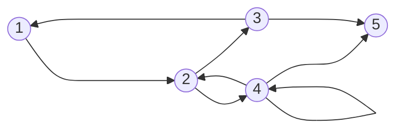

## What

A path is a finite or inifinte sequennce of vertices of a graph.

## Why

We use paths to check the feasibility of a program, whethere it's feasible for all inputs or only certain inputs. 

This will help us find faults in the program that maybe not be usually found just by executing the code.

## How

Take for example the following graph:

