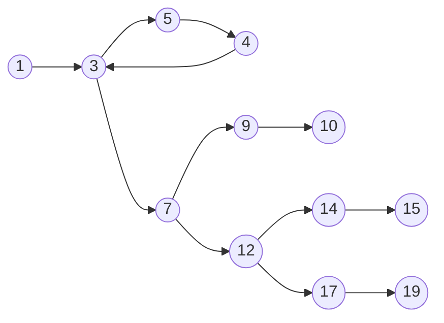
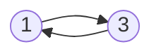

## What

Graphs have vertices(V) and edges(E).

Vertices are connected using directional arrows which represent edges.

Vertices (V) and Edges (E) are considered as individual sets and the graph as a pair set of (V,E).

All the graphs considered in this module are finite (meaning they all end). Not sure if there are inifinite graphs.

Program graphs are just graphs that represent the control flow of a program.

Each ==simple program statement is considered a vertex/node== (numbers) and the connection or ==flow from one statement to another is represented using edges==(arrows).

#### D-D Graphs

Branch points like `if-else`, `switch case` statements can lead to multiple edges from a single vertex.

**Outdegree** : Formal definition -


## Why

==Any program flow can be represented using a graph==. 

It will help us ==visualise the program== and its flow. 

It can also help us ==find any infeasible paths== in the program that no input can reach.

## How

**Consider a simple program:**

```Java
public int foo(int x, int y)
{
	for (int i=0; i<y; i++)
	{
		x = bar(x);
	}
	if (x == y)
	{
		y = x + y;
		return baz(x, y, y);
	}
	else if (x > y)
	{
		x = x - y;
		return baz(y, x, x);
	}
	else
	{
		return 23;
	}
}
```

**The program graph for the above program:**


The ==parantheses== / opening and closing brackets are ==not considered== as part of the graph. 

The r==eturn statement is usually the end== of the graph unless the graph has a recursive statement.

Loops are represented by adding an arrow back to the statement where the loop started from.

In a `for loop`, the arrow is added back from the loop exit condition, in the example above, loop exit condition would be `i < y`, so an arrow is added back from there to the beginning of the loop. In the example, the exit condition is considered as statement 4.

For a `while loop`, this is how it would be like:

```Java
while(guardCondition)
{
	doSomething();
}
```

Program graph for the above `while loop`:


