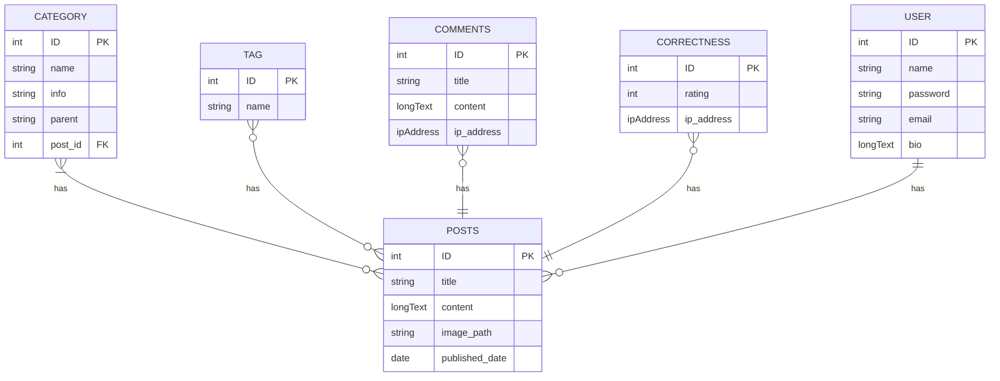

### Models
- **Category**
	- ID
	- Name
	- Info
	- Parent
- **Tag**
	- ID
	- Name
- **User**
	- ID
	- Name
	- E-mail
	- Password
	- Bio
	- Last Login
	- Registration Date
	- Date of birth
	- Photo
- **Correctness**
	- ID
	- UserID
	- Rating
	- IP
- **Comment**
	- ID
	- UserID
	- PostID
	- Title
	- Content
	- IP
- **Post**
	- ID
	- Title
	- Content
	- Featured Image
	- UserID
	- CategoryID
	- TagID
	- Last Update
	- Pubished Date

Entity Relationship Diagram

